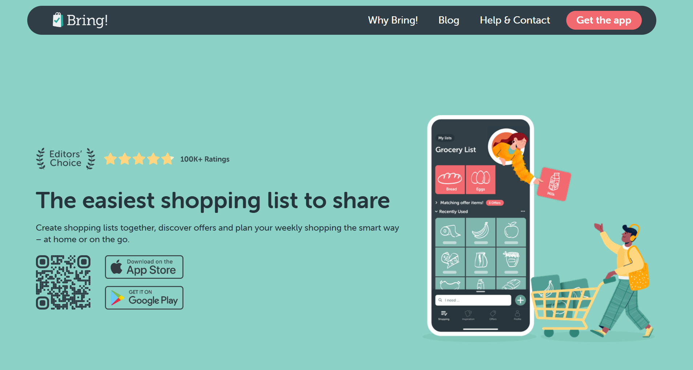
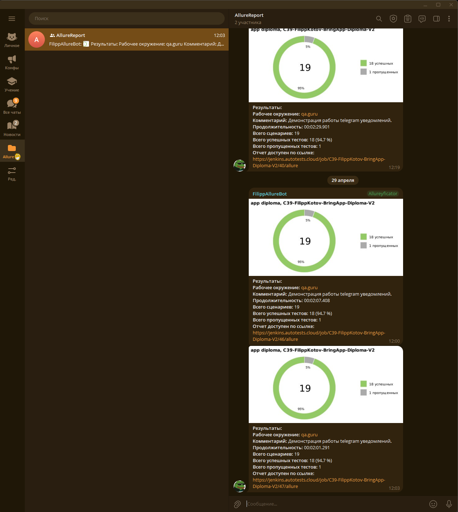
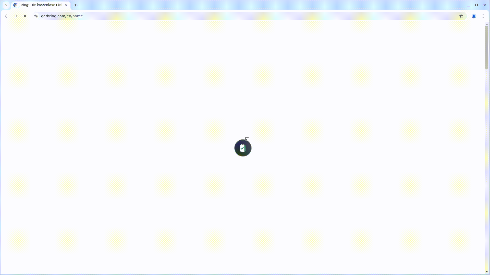
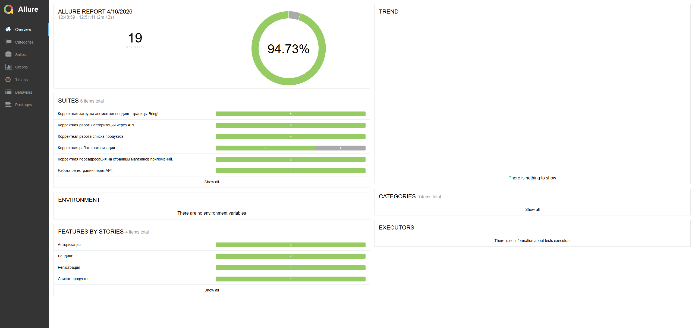
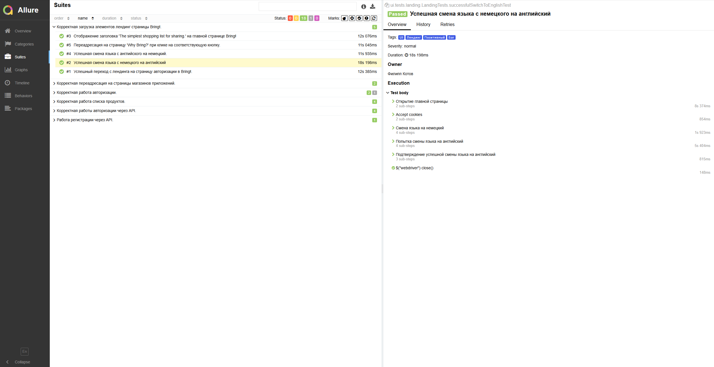
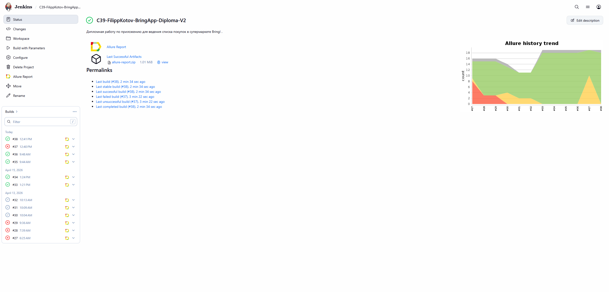
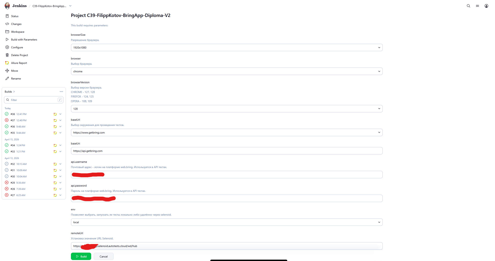

<h1 align="center">Проект автоматизации тестирования <a target="_blank" href="https://www.getbring.com/">Bring!</a></h1>  



<p align="center">  
  UI + API автотесты для Bring! shopping list.   
</p>  
  
<p align="center">  
  <b>Java • JUnit 5 • Selenide • RestAssured • Owner • Allure • Selenoid • Appium-ready</b>  
</p>  
  
---  
  
## Содержание  
- [Описание проекта](#описание-проекта)  
- [Технологии и инструменты](#технологии-и-инструменты)  
- [Архитектура проекта](#архитектура-проекта)  
- [Реализованные проверки](#реализованные-проверки)  
  - [UI](#ui)  
  - [API](#api)  
- [Особенности проекта](#особенности-проекта)  
- [Запуск тестов](#запуск-тестов)  
  - [Локальный запуск](#локальный-запуск)  
  - [Запуск по тегам](#запуск-по-тегам)  
  - [Удалённый запуск](#удалённый-запуск)  
- [Конфигурация проекта](#конфигурация-проекта)  
- [Интеграция с Allure Report](#интеграция-с-allure-report)  
- [Интеграция с Jenkins](#интеграция-с-jenkins)
  
---  
  
## Описание проекта  
  
**Bring!** — сервис для создания, ведения и совместного использования списков покупок.  
  
Данный проект представляет собой набор **автоматизированных UI- и API-тестов** для проверки ключевой функциональности web-версии сервиса.  
  
Проект покрывает:  
- валидацию и навигацию web-интерфейса  
- переходы между страницами и внешними сервисами  
- авторизацию через API  
- работу со списком покупок через API  
- конфигурируемый запуск тестов локально и удалённо  
  
---  
  
## Технологии и инструменты  

<div style="display: flex; flex-wrap: wrap; gap: 16px; align-items: center; justify-content: center; margin: 16px 0;">
  <a href="https://www.jetbrains.com/idea/"></a>
  <a href="https://github.com/allure-framework/"></a>
<a href="https://github.com/"></a>  
<a href="https://gradle.org/"></a>  
<a href="https://www.java.com/"></a>
<a href="https://www.jenkins.io/"></a>
<a href="https://www.atlassian.com/software/jira"></a>  
<a href="https://junit.org/junit5/"></a>
<a href="https://rest-assured.io/"></a>
<a href="https://selenide.org/"></a>
  <a href="https://telegram.org/"></a>
<a href="https://aerokube.com/selenoid/"></a>

</div>

___
  
**Используемый стек:**  
- `Java 17`  
- `JUnit 5`  
- `Gradle`  
- `Selenide`  
- `RestAssured`  
- `Allure Report`  
- `Owner`  
- `Lombok`  
- `Selenoid`  
  
---  
  
## Архитектура проекта  
  
Проект разделён на логические слои:  
  
### UI слой  
- `Page Object Model`  
- базовый `TestBase` для настройки браузера  
- отдельные page objects для:  
  - лендинга  
  - страницы авторизации  
  - страниц магазинов приложений  
  - компонентов интерфейса  
  
### API слой  
- выделенные request / response specs  
- DTO / model-классы для работы с телами запросов и ответов  
- отдельный слой API-методов:  
  - авторизация  
  - работа со списком покупок  
  
### Config слой  
- `Owner` для управления параметрами запуска  
- отдельные `.properties` для:  
  - API  
  - UI  
  
### Отчётность  
- Allure attachments:  
  - screenshot  
  - page source  
  - browser console logs  
  - video  

#### Отчёт в Telegram



#### Видео выполнения
  


  
## Реализованные проверки  
___
## UI  
  
### Лендинг  
- [x] Проверка отображения главного заголовка  
- [x] Проверка перехода на страницу `Why Bring?`  
- [x] Проверка смены языка с английского на немецкий  
- [x] Проверка смены языка с немецкого на английский  
- [x] Проверка перехода на страницу авторизации  
- [x] Проверка перехода в Google Play  
- [x] Проверка перехода в Apple App Store  
  
### Авторизация  
- [x] Поле email не принимает значение, не соответствующее маске email  
- [x] Поле email не должно принимать значения короче допустимого минимума  
- [x] Поле email не должно принимать значения длиннее допустимого максимума    
      *(в проекте зафиксирован известный баг)*  
  
---  
  
## API  
  
### Авторизация  
- [x] Успешный логин с валидными учётными данными  
- [x] Успешное получение `access_token`  
- [x] Ошибка авторизации при невалидных данных  
- [x] Попытка регистрации в обход captcha  
  
### Список покупок  
- [x] Получение списка покупок  
- [x] Добавление товара в список  
- [x] Добавление товара с описанием  
- [x] Удаление товара из списка  
  
---  
  
## Особенности проекта  
  
### Гибкая конфигурация  
Проект использует `Owner`, благодаря чему можно:  
- удобно хранить параметры окружения  
- переключать режим запуска  
- передавать переменные через `-D`  
  
### Разделение по тегам  
Тесты размечены тегами `UI` и `API`, что позволяет запускать их раздельно. Также для удобства навигации добавлены прочие теги.
  
### DTO-модели  
Для API используются отдельные модели запросов и ответов, что делает код чище и облегчает поддержку.  
  
### Повторное использование авторизации  
В API-части реализована автоматическая авторизация с получением:  
- `access_token`  
- `bringListUUID`  
  
### Поддержка удалённого запуска  
UI-тесты можно запускать как локально, так и в удалённом браузере через `Selenoid`.  
  
### Расширенный Allure-отчёт  
После выполнения UI-тестов к отчёту автоматически прикладываются:  
- screenshot  
- page source  
- console logs  
- video  
  
---  
  
## Локальный запуск  
  
### Все тесты  
```bash  
gradle clean test
```

### Все UI-тесты
```bash  
gradle clean ui
```

### Все API-тесты
```bash  
gradle clean api
```

---

## Запуск по тегам

### API
```bash  
gradle clean api
```
### UI
```bash
gradle clean ui
```
---

## Удалённый запуск

Для удалённого запуска UI-тестов используется `Selenoid`.

### Пример запуска
```bash
gradle clean ui -Denv=remote -DremoteUrl=http://SELENOID/wd/hub
```
### Параметры запуска

-Denv=remote  
-DremoteUrl=URL  
-Dbrowser=chrome  
-DbrowserVersion=128  
-DbrowserSize=1920x1080

---

## Конфигурация проекта

Конфигурационные файлы расположены в:

src/test/resources/config

### Основные файлы

- `api.properties`
- `api.local.properties`
- `ui.properties`
- `mobile.properties`

### Что можно настраивать

- API base URI
- API auth path
- логин и пароль пользователя
- браузер
- версия браузера
- размер окна
- локальный / удалённый запуск
- адрес remote WebDriver / Selenoid

---

## Интеграция с Allure Report

После выполнения тестов можно сгенерировать Allure-отчёт:

### Сгенерировать отчёт

gradle allureReport

### Открыть отчёт в браузере

gradle allureServe

### Что отображается в отчёте

- шаги теста
- статус выполнения
- вложения
- ошибки и stack trace
- screenshot
- page source
- browser logs
- video

</a>
</a>


---

## Интеграция с Jenkins

Проект подготовлен к запуску из Jenkins с параметрами.

Что удобно передавать в Jenkins:

- `env`
- `remoteUrl`
- `browser`
- `browserVersion`
- `browserSize`

### Пример запуска из Jenkins

gradle clean ui -Denv=remote -DremoteUrl=http://ВАШ_SELENOID/wd/hub

</a>
</a>

---
